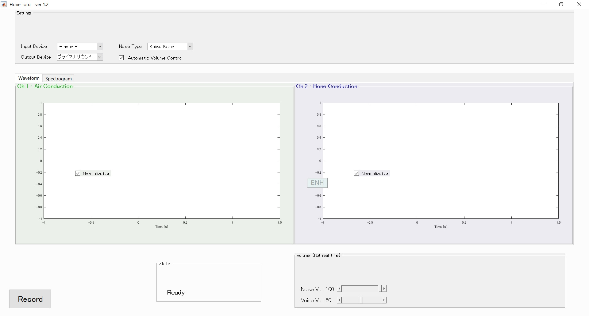

# 骨導音声をディスプレイするアプリ *Honetoru*

骨導音声と起動音声を録音してその波形とスペクトルを表示する，オープンラボ用Matlabアプリ．

# 実行環境

### [完成前]  

↓

↓

↓

↓

↓

↓

↓

↓

↓

↓

↓

↓

↓

### [完成後]
  

- PC
- 骨導マイクロホン
- 骨導マイクロホン用アンプ
- 一般のマイクロホン
- 一般のマイクロホン用アンプ ( audio-technica AT-HA2 )
- オーディオインターフェイス ( Roland UA-101 )

# どうやって使うの？

まずはすべてのファイルをダウンロードしてください．

## ファイル群

- **`Honetoru_ver_1_2.m`**  
  実行メインファイル．**これを実行してください．**
  
- `SpeechEnhancement.m`  
  音声強調を行う関数．
  
- `JointMAP20161006.m`  
  SpeechEnhancement.m 内で使うJoint MAP法関数．
  
- `spectra.m`  
  スペクトルを計算する関数．

- `Symmetry.m`  
  周波数特性の対称性を保証する関数．
  
  
## 操作手順
**実行画面**

1.Recordを押す。

2.雑音が流れるので、体験者にしゃべってもらう。

3.stopを押す。

4.画面に波形ができる。(左図が気導音、右図が骨導音の波形)

5.波形をクリックすると音声が流れる。これを聞き比べてもらう。

# 補足の説明

### [1. 雑音除去法 ]

雑音除去には，**Joint MAPを用いたMMSE-STSA法**を使っている[[Link](http://citeseerx.ist.psu.edu/viewdoc/download?doi=10.1.1.467.6336&rep=rep1&type=pdf)]．各フレームで雑音のゲインと音声のゲインをMAP推定に基づき推定している．

### [2. 音質改善法 ]

音質改善には**Ling Time averaged spectrum（LTAS：長時間平均スペクトル)法**を使っている．
まず音声をフレームごとに分割して，振幅スペクトルを求める．
全フレームの振幅特性に対して平均することで長時間平均スペクトルを求める．
そして各フレームにおける振幅スペクトルに対して，長時間平均スペクトルを除算することで気導音声のスペクトルを復元する．
